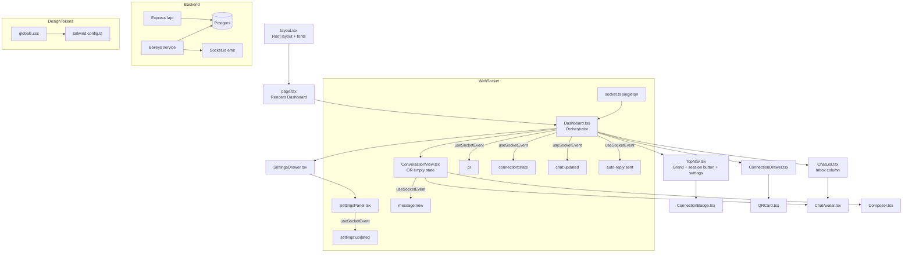
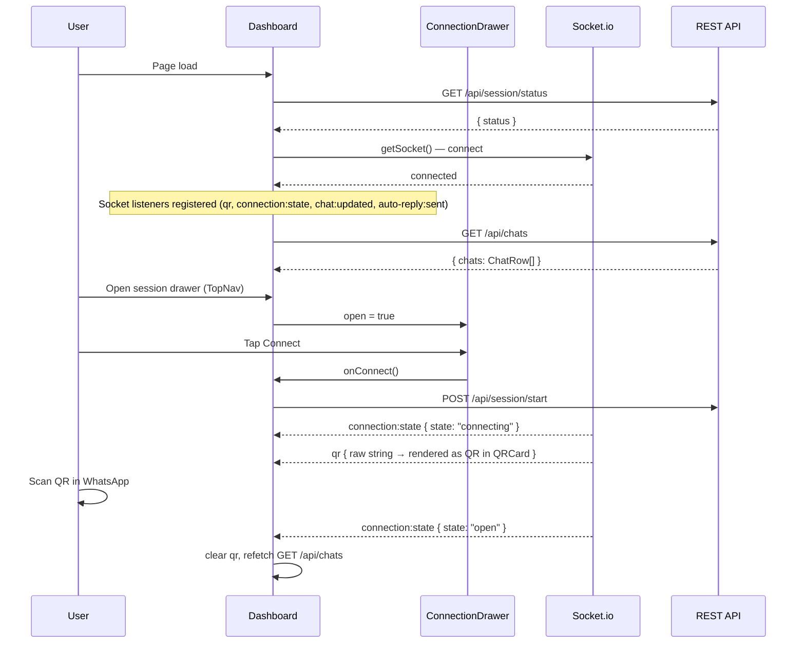
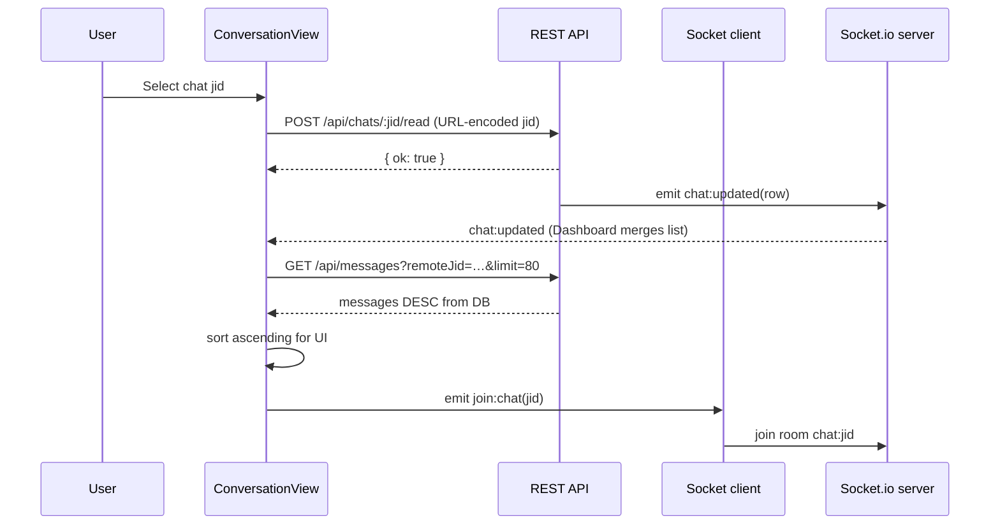
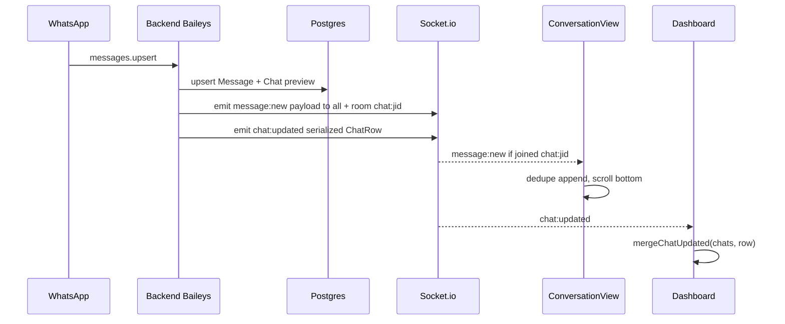
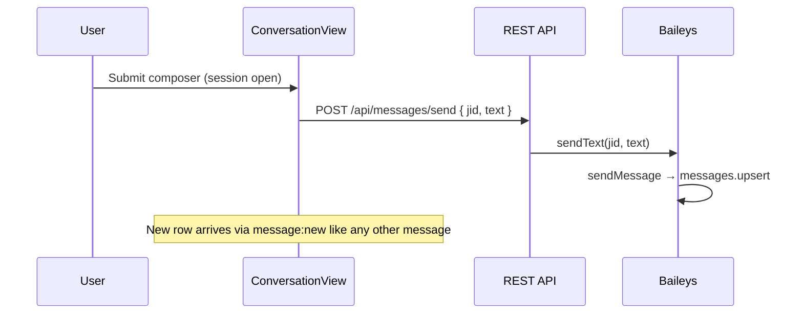
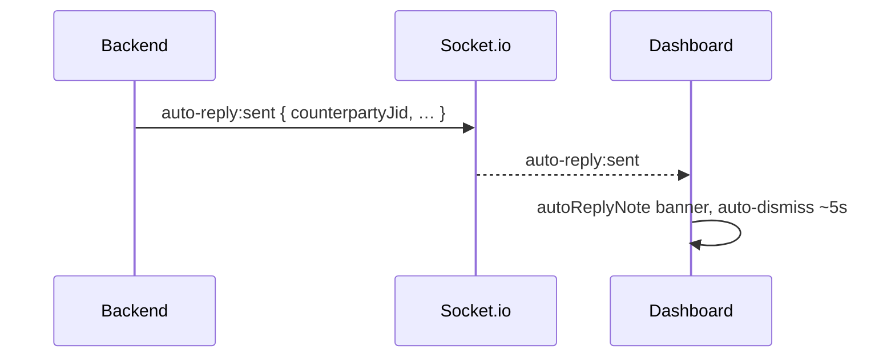

# Design Document: Frontend Redesign (WhatsApp-Style Inbox)

## Overview

The WhatsApp automation dashboard uses a **Shopify-inspired dark design system** (forest–teal surfaces, neon green accents) with a **WhatsApp-like product flow**:

- **Chats first**: A dedicated chat list (search, avatars, last-message preview, WhatsApp-style row times, unread pills) is always the primary left column on desktop and full-screen on mobile until a thread is opened.
- **Per-conversation thread**: Selecting a chat opens **`ConversationView`**, which loads **only that chat’s** messages over REST, joins the Socket.io room `chat:${jid}`, appends **`message:new`** in real time, shows **oldest → newest** bubbles with **date dividers** and **group sender labels**, and includes a **composer** for manual **`POST /api/messages/send`** when the session is open.
- **Session elsewhere**: QR code, Connect, Logout, and a shortcut to auto-reply settings live in **`ConnectionDrawer`**, opened from the header (not mixed into the chat list column).
- **Live chat metadata**: The backend emits **`chat:updated`** whenever a chat row changes (preview, name, unread, timestamps). **`Dashboard`** merges that into `chats[]` and re-sorts by `lastMessageAt` (no global “all messages” feed; no initial **`GET /api/messages`** without `remoteJid`).

The UI remains a single-page app: **`layout.tsx`** + **`page.tsx`** shell, **`Dashboard`** as client orchestrator, **`TopNav`** sticky header, **`SettingsDrawer`** for auto-reply, plus **`ConnectionDrawer`** for session.

**Scope note:** `frontend/lib/` is **not** frozen anymore for inbox work — **`types.ts`** defines extended **`ChatRow`**, **`SocketEventMap`**, and related DTOs shared with components.

**See also:** Backend REST routes, Baileys wiring, and every Socket.io emit/listener are documented in [`backend-architecture.md`](./backend-architecture.md).

---

## Architecture



### Layout behavior (responsive)

| Viewport | Chat list | Conversation / empty |
|----------|------------|-------------------------|
| **`width < 640px` (default)** | Full width when **no** thread showing, or when user **back** from thread | Full width when a chat is **selected** and **`mobileShowFeed`** is true; hidden when browsing list |
| **`width ≥ 640px` (`sm:`)** | Fixed column **`280px`** (`sm:grid-cols-[280px_1fr]`) | Remaining `1fr` |
| **`width ≥ 1024px` (`lg:`)** | Column **`320px`** (`lg:grid-cols-[320px_1fr]`) | Remaining `1fr` |

The `<main>` grid in **`Dashboard`** intentionally keeps the class string `grid-cols-1 … sm:grid-cols-[280px_1fr] … lg:grid-cols-[320px_1fr]` for static layout tests.

---

## Sequence Diagrams

### WebSocket connection, QR, and post-open data



**Important:** After this redesign, the dashboard **does not** call **`GET /api/messages?limit=…`** on first paint. Messages load only inside **`ConversationView`** when a **`jid`** is selected.

### Open a conversation (REST + room + mark read)



### Incoming message (thread + list)



### Outgoing manual message



### Auto-reply toast (unchanged path)



---

## REST API (dashboard-relevant)

| Method | Path | Purpose |
|--------|------|---------|
| `GET` | `/api/session/status` | Current Baileys session state |
| `POST` | `/api/session/start` | Start / resume connection |
| `POST` | `/api/session/logout` | Log out and wipe auth |
| `GET` | `/api/chats` | All chat rows (serialized **`ChatRow`** shape including preview fields) |
| `POST` | `/api/chats/:jid/read` | Set **`unreadCount = 0`**; **`jid`** must be URL-encoded in the path (e.g. `%40` for `@`) |
| `GET` | `/api/messages` | Optional **`remoteJid`**, **`limit`** (default 50, max 200), **`before`** (cursor) |
| `POST` | `/api/messages/send` | Body **`{ jid, text }`** — requires open socket session |
| `GET` / `PATCH` | `/api/settings` | Auto-reply settings (unchanged) |

**Base URL:** `frontend/lib/api.ts` uses **`NEXT_PUBLIC_BACKEND_URL`** (trimmed, no trailing slash); if unset, **`http://localhost:4000`**.

---

## Backend (persistence and realtime)

### `Chat` entity (`backend/src/db/entities/Chat.ts`)

Besides **`jid`**, **`name`**, **`lastMessageAt`**, **`unreadCount`**, **`updatedAt`**:

- **`isGroup`**: `true` when **`jid`** ends with **`@g.us`**
- **`lastMessageBody`**, **`lastMessageType`**, **`lastMessageFromMe`**, **`lastSenderName`**: last-line preview for the inbox list

### Baileys (`backend/src/whatsapp/baileys.service.ts`) — names and previews

- **`persistMessage`**: Upserts **`Message`**, updates chat preview + timestamps + unread; emits **`message:new`** and **`emitChatUpdated`** (skipped for bulk history via **`skipChatEmit`** to limit socket noise).
- **`contacts.upsert` / `contacts.update`**: Fill **`Chat.name`** from contact **`name` → `notify` → `verifiedName`** when the stored name is still empty.
- **`groups.upsert` / `groups.update`**: Set **`Chat.name`** from group **`subject`**, **`isGroup = true`**.
- **`chats.upsert`**: If group **`jid`** and no name, try **`groupMetadata(jid).subject`** (errors ignored).
- **`messaging-history.set`**: Processes **`contacts`** from sync plus history messages with **`skipChatEmit`** on each message persist.

### Socket gateway (`backend/src/realtime/socket.gateway.ts`)

- **`emitMessage(jid, payload)`**: **`io.emit("message:new", …)`** and **`io.to("chat:" + jid).emit(…)`**
- **`emitChatUpdated(chatRowPayload)`**: **`io.emit("chat:updated", …)`** — full serialized row for the UI list
- Client events **`join:chat`** / **`leave:chat`** join/leave **`chat:${jid}`** rooms

### Serialization (`backend/src/db/chat-serialize.ts`)

**`chatToPayload(chat: Chat)`** produces the same JSON shape the frontend expects as **`ChatRow`**.

---

## Components and Interfaces

### `TopNav`

**Purpose:** Sticky header: branding, **one control** that opens session (**`ConnectionDrawer`**), and settings gear.

**Props:**

```typescript
interface TopNavProps {
  conn: ConnectionState;
  busy: boolean;
  onOpenConnection: () => void;
  onOpenSettings: () => void;
  autoReplyNote: string | null;
  onDismissAutoReply: () => void;
  sessionError: string | null;
  onDismissSessionError: () => void;
}
```

**Responsibilities:**

- **`ConnectionBadge`** is shown **inside** a **button** that calls **`onOpenConnection`** (session + QR live here, not in the inbox column).
- **No** inline Connect / Logout pills in the nav bar.
- Dismissible banners for **`sessionError`** and **`autoReplyNote`** below the nav when set.
- Product copy uses **“WA Desk”** (not “WA Automation”) in the current implementation.

---

### `ConnectionDrawer`

**Purpose:** Slide-over / bottom sheet (same motion pattern as **`SettingsDrawer`**): QR, Connect, Logout, and a control that closes the drawer then opens **`SettingsDrawer`** for auto-reply.

**Props:**

```typescript
interface ConnectionDrawerProps {
  open: boolean;
  onClose: () => void;
  qr: string | null;
  connected: boolean; // conn === "open" from parent
  busy: boolean;
  onConnect: () => void;
  onLogout: () => void;
  onOpenSettings: () => void;
}
```

**Connect** is disabled when **`connected || busy`**.

---

### `ConnectionBadge`

Unchanged semantics: idle / connecting / open / close mapping to dot + pill styles (see existing implementation in **`ConnectionBadge.tsx`**).

---

### `QRCard`

**Props:** **`qr: string | null`**, **`connected: boolean`**. Hosted inside **`ConnectionDrawer`**, not beside the chat list.

Renders **`QRCodeSVG`** from **`qrcode.react`** when a raw QR string is present (not necessarily a `data:` URL — the component treats non-`data:` values as plain text to encode). Responsive **`qrSize`** (148 / 168 / 200 px) based on viewport width. Linked state: **`CheckCircle2`**, title **“WhatsApp linked”**, subtitle **“Session is active · messages stream live”**. Idle state prompts user to tap **Connect** in the drawer to show a QR.

---

### `ChatList`

**Purpose:** WhatsApp-like inbox column — search, rows, previews, times, unread.

**Props:**

```typescript
interface ChatListProps {
  chats: ChatRow[];
  selectedJid: string | null;
  onSelect: (jid: string) => void; // always a real chat jid — no "All messages" row
  isLoading: boolean;
  className?: string;
}
```

**Responsibilities:**

- **Search** input filters by **`name`** or **`jid`** (client-side).
- Each row: **`ChatAvatar`**, **`name || jid`**, one-line **preview** (`You: …`, group **`sender: body`**, or body / `(messageType)`), **WhatsApp-style time** (today → time; yesterday → label; recent → short weekday; else numeric date), **unread** pill (neon green when unread count is greater than zero).
- **Selected** row: forest background + **neon left border** + subtle ring.
- **Skeleton** placeholders while **`isLoading`**.
- **Does not** subscribe to sockets itself — parent owns **`chats`** state.

---

### `ChatAvatar`

**Props:** **`jid`**, **`label`** (for initials), optional **`size`** (`sm` | `md`), optional **`className`**.

Deterministic **HSL** background from hashing **`jid`**; initials from first letters of **`label`**.

---

### `ConversationView`

**Purpose:** Single-thread UI: header, scrollable messages (**oldest at top**), **`Composer`**.

**Props:**

```typescript
interface ConversationViewProps {
  jid: string;
  chat: ChatRow | null; // resolved from Dashboard.chats for title + isGroup
  conn: ConnectionState;
  onBack?: () => void; // mobile: back to list
}
```

**Lifecycle / data:**

1. **`POST /api/chats/:jid/read`** on mount (and when **`jid`** changes) — non-fatal on failure.
2. **`GET /api/messages?remoteJid=encodeURIComponent(jid)&limit=80`** — responses ordered **DESC** from API; component **re-sorts ascending** for display.
3. **`getSocket().emit("join:chat", jid)`** on mount; **`leave:chat`** on cleanup / **`jid`** change.
4. **`useSocketEvent("message:new", …)`** — ignores events where **`remoteJid !== jid`**; **`dedupAppendAsc`** maintains order by **`messageTimestampMs`** then **`id`**.

**Rendering:**

- Header: optional back (**`sm:hidden`**), avatar (hidden on smallest breakpoint in current layout), **title**, subtitle **Group | Direct** + **Live** (pulsing radio).
- **Date dividers:** Today / Yesterday / long weekday date when calendar day changes.
- **Group sender line** above bubble when **`isGroup && !fromMe`** and sender key changed vs previous message (participant / pushName composite).
- Bubbles: outgoing right (**forest** + neon ring), incoming left (**dark-forest** + border); **intent** / **matchedMatch** badges preserved; time inside bubble (**HH:mm**).
- **Scroll:** smooth scroll to bottom anchor when list length or **`jid`** changes.
- **`Composer`**: disabled unless **`conn === "open"`**; **`POST /api/messages/send`**. Placeholder switches between **`"Message"`** and **`"Connect to send messages"`** depending on session state.

---

### `Composer`

**Props:** **`disabled`**, **`onSend(text)`**, optional **`placeholder`**.

**Keyboard:** **`Enter`** (without **Shift**) calls **`preventDefault`** and submits the trimmed text. **`Shift+Enter`** leaves default textarea behavior so the user can insert a newline. The textarea is **`resize-y`** with **`max-h-32`**. Submit button shows a **spinner** while **`onSend`** is in flight and is disabled when **`disabled`**, **`sending`**, or the field is empty/whitespace-only.

---

### `SettingsDrawer` / `SettingsPanel`

Unchanged product role: auto-reply configuration, **`settings:updated`** live sync, **`PATCH /api/settings`**, same drawer UX pattern as before.

---

### Removed components (do not reference in new work)

- **`Sidebar.tsx`** — removed; session UI moved to **`ConnectionDrawer`**.
- **`MainPanel.tsx`**, **`MessageFeed.tsx`** — removed; replaced by **`ConversationView`**.

---

## Data models

### `MessageDto` (`frontend/lib/types.ts`)

Unchanged core fields: **`id`**, **`remoteJid`**, **`fromMe`**, **`participant`**, alts, **`pushName`**, **`messageType`**, **`body`**, **`messageTimestampMs`**, **`createdAt`**, optional **`intent`**, **`matchedMatch`**.

### `ChatRow`

```typescript
type ChatRow = {
  jid: string;
  name: string | null;
  isGroup: boolean;
  lastMessageAt: string | null;
  unreadCount: number;
  updatedAt: string;
  lastMessageBody: string | null;
  lastMessageType: string | null;
  lastMessageFromMe: boolean | null;
  lastSenderName: string | null;
};
```

### `SocketEventMap` (documentation)

```typescript
type SocketEventMap = {
  qr: { qr: string };
  "connection:state": { state: string };
  "message:new": MessageDto;
  "chat:updated": ChatRow;
  "auto-reply:sent": { counterpartyJid?: string; sourceMessageId?: string | null };
  "settings:updated": AutoReplySettingsDto;
};
```

### `DashboardState` (conceptual)

```typescript
interface DashboardState {
  conn: ConnectionState;
  qr: string | null;
  chats: ChatRow[];
  selectedJid: string | null;
  loading: boolean;
  loadingChats: boolean;
  busy: boolean;
  err: string | null;
  autoReplyNote: string | null;
  settingsOpen: boolean;
  connectionOpen: boolean;
  mobileShowFeed: boolean;
}
```

**Note:** There is **no** global **`messages[]`** in **`Dashboard`** anymore. **`ConversationView`** holds **`items: MessageDto[]`** locally per open **`jid`**.

### `DesignTokens`

Unchanged CSS variable / Tailwind token story (`void`, `deep-teal`, `dark-forest`, `forest`, `card-border`, `neon-green`, `muted-text`, `shade-50`, `shade-70`, shadows, focus ring).

---

## Algorithmic behavior

### `mergeChatUpdated(chats, row)` (`Dashboard.tsx`, exported)

1. Remove any existing row with **`row.jid`**.
2. Prepend **`row`**.
3. Sort by **`lastMessageAt`** DESC (missing dates sort as **0**); tie-breaker **`updatedAt`** DESC string compare.

### `normalizeChatRow(partial)`

Ensures every **`ChatRow`** field has defaults (e.g. **`isGroup`** inferred from **`@g.us`** if missing from API during rollout).

### Selecting a chat (`Dashboard`)

- Sets **`selectedJid`**
- **Optimistically** sets **`unreadCount = 0`** for that jid in **`chats`**
- On **&lt;640px**, sets **`mobileShowFeed = true`** so the thread column is shown full width

### Back from thread (mobile)

- **`onBack`**: clears **`mobileShowFeed`** and **`selectedJid`**

### `ConversationView` message merge

**`dedupAppendAsc`:** if **`msgKey`** already exists, return previous array; else append and sort by **`messageTimestampMs`** ascending then **`id`**.

### `updateChatList` / `deduplicateMessages` (`Dashboard.tsx`)

Still **exported** for **unit tests** (`updateChatList` marked deprecated for production list logic; real list merges use **`chat:updated`** from the server).

---

## Key functions (formal notes)

### `getSocket()` (`frontend/lib/socket.ts`)

Singleton Socket.io client; **`resetSocket()`** on logout closes and clears listeners.

### `useSocketEvent(event, handler)`

Same contract as before: register on mount, stable handler ref, cleanup on unmount.

### `Dashboard` + **`chat:updated`**

**Postcondition:** After each **`chat:updated`** event, **`chats`** contains the new row for that **`jid`** at the correct sort position per **`mergeChatUpdated`**.

### `ConversationView` + **`message:new`**

**Postcondition:** For the active **`jid`**, **`items`** gains at most one new row per unique **`msgKey`**, order ascending by time.

### `SettingsPanel.save()`

Unchanged: **`PATCH /api/settings`**, busy semantics, validation.

---

## Example: socket wiring in `Dashboard`

```typescript
useSocketEvent("qr", (d) => {
  const p = d as { qr: string };
  if (p?.qr) setQr(p.qr);
});

useSocketEvent("connection:state", (d) => {
  const p = d as { state: string };
  if (p?.state) {
    setConn(p.state as ConnectionState);
    if (p.state === "open") {
      setQr(null);
      void refetch(); // GET /api/chats only
    }
  }
});

useSocketEvent("chat:updated", (d) => {
  const row = normalizeChatRow(d as Partial<ChatRow> & { jid: string });
  setChats((prev) => mergeChatUpdated(prev, row));
});

useSocketEvent("auto-reply:sent", (d) => {
  const p = d as { counterpartyJid?: string };
  if (p?.counterpartyJid) {
    const shortJid = p.counterpartyJid.split("@")[0] ?? p.counterpartyJid;
    setAutoReplyNote(`Auto-reply sent to ${shortJid}`);
    setTimeout(() => setAutoReplyNote(null), 5000);
  }
});
```

**`message:new`** is **not** handled in **`Dashboard`** for the inbox list; **`chat:updated`** carries list deltas. **`ConversationView`** handles **`message:new`** for the open thread.

---

## Correctness properties (updated)

1. **Socket listeners before / alongside bootstrap:** **`qr`**, **`connection:state`**, **`chat:updated`**, **`auto-reply:sent`** are registered from **`Dashboard`** early; **`ConversationView`** adds **`message:new`** while mounted.
2. **`mergeChatUpdated`:** For any **`chats`** and **`row`**, the result contains exactly one row per **`jid`**, sorted by **`lastMessageAt`** DESC then **`updatedAt`** DESC.
3. **`ConversationView` filter:** Only messages with **`remoteJid === jid`** are appended from **`message:new`**.
4. **Room hygiene:** **`leave:chat`** runs when **`jid`** changes or the component unmounts.
5. **`ConnectionBadge` mapping:** Deterministic state → visuals (unchanged).
6. **Layout breakpoints:** **`grid-cols-1`** below **`sm`**, two columns from **`sm`** upward with widths **`280px` / `320px`** at **`lg`** (see **`Dashboard`** **`main`** **`className`**).
7. **Settings save busy invariant:** Still applies to **`SettingsPanel`** save path.
8. **Focus / pills / surfaces / text colors:** Same design-system rules as the original redesign doc where still applicable.

---

## Error handling

| Scenario | Behavior |
|----------|----------|
| Socket disconnect | Client reconnects with configured delay; **`connection:state`** may refire; **`refetch`** chats when **open** |
| Session start failure | **`err`** banner; retry from **`ConnectionDrawer`** |
| Settings save failure | Inline error in **`SettingsPanel`** |
| Initial load failure | **`GET /api/session/status`** or **`GET /api/chats`** failure sets **`err`**; no messages fetch at root |
| Conversation fetch failure | **`ConversationView`** shows error text in the scroll area |
| Send failure | **`POST /api/messages/send`** returns **400** with **`error`** — surface via future UX or network toast (composer stays enabled/disabled per **open** state) |
| QR timeout | New **`qr`** events replace the image automatically |

---

## Testing strategy

### Unit / property tests (current)

- **`deduplicateMessages`**, **`updateChatList`** — `frontend/__tests__/deduplicateMessages.test.ts`, **`updateChatList.test.ts`** (**`ChatRow`** arbitrary includes all new fields).
- **`filterMessages`** — still in **`messageFeedFilter.test.ts`** as a pure helper (not tied to removed **`MessageFeed`**).
- **`Dashboard`** layout class string — **`dashboardLayout.test.ts`**.
- **`ConnectionBadge`**, **`settingsBusy`** — unchanged files.

### Recommended additions

- **`mergeChatUpdated`** property tests (sort + dedupe by **`jid`**).
- **`normalizeChatRow`** defaults.
- Thin **`ConversationView`** test with mocked **`getJson`** / socket (optional).

---

## Performance

- **Per-thread fetch:** Default **80** messages per open chat (tune via **`limit`** query param; server max **200**).
- **History sync:** Bulk history persistence skips per-message **`chat:updated`** emits to reduce flood; **`GET /api/chats`** after **open** refreshes previews.
- **Socket singleton:** One connection per tab.
- **Virtualization:** Not required at current limits; consider **`@tanstack/virtual`** if limits grow past **~500** rows per thread.

---

## Security notes

- **JID display:** Truncated / secondary in UI where possible; full **`jid`** on **`title`** attributes where implemented.
- **Send endpoint:** **`POST /api/messages/send`** trusts the server session — same deployment assumptions as the rest of the dashboard (no extra UI auth layer documented here).
- **Settings PATCH:** Whitelisted fields only.
- **QR:** Client-only display for linking.

---

## Dependencies

Unchanged stack: **Next.js**, **React**, **Tailwind**, **shadcn/Radix** primitives, **socket.io-client**, **lucide-react**, **qrcode** (server terminal) / **qrcode.react** (client **`QRCard`** per implementation), **Baileys**, **TypeORM**, **PostgreSQL**.

---

## File inventory (post–WhatsApp-style inbox)

### Frontend — primary

| Path | Role |
|------|------|
| `frontend/app/globals.css` | Design tokens, base styles |
| `frontend/app/layout.tsx` | Fonts, **`html` dark** |
| `frontend/app/page.tsx` | Renders **`Dashboard`** |
| `frontend/tailwind.config.ts` | Extended palette / fonts |
| `frontend/lib/types.ts` | **`MessageDto`**, **`ChatRow`**, **`SocketEventMap`**, settings types |
| `frontend/lib/api.ts` | **`apiBase`**, **`getJson`**, **`postJson`**, **`patchJson`** |
| `frontend/lib/socket.ts` | **`getSocket`**, **`resetSocket`** |
| `frontend/lib/use-socket-event.ts` | **`useSocketEvent`** |
| `frontend/components/Dashboard.tsx` | Layout, **`mergeChatUpdated`**, socket orchestration |
| `frontend/components/TopNav.tsx` | Header + session button |
| `frontend/components/ConnectionDrawer.tsx` | QR + connect + logout + link to settings |
| `frontend/components/ChatList.tsx` | Inbox UI |
| `frontend/components/ConversationView.tsx` | Thread + **`join:chat`** + **`message:new`** |
| `frontend/components/Composer.tsx` | Outbound text |
| `frontend/components/ChatAvatar.tsx` | Initials avatars |
| `frontend/components/ConnectionBadge.tsx` | Status pill |
| `frontend/components/QRCard.tsx` | QR / linked states |
| `frontend/components/SettingsDrawer.tsx` | Auto-reply drawer |
| `frontend/components/SettingsPanel.tsx` | Auto-reply form |

### Frontend — removed

| Path | Reason |
|------|--------|
| `frontend/components/Sidebar.tsx` | Session moved to **`ConnectionDrawer`** |
| `frontend/components/MainPanel.tsx` | Replaced by **`ConversationView`** shell |
| `frontend/components/MessageFeed.tsx` | Replaced by **`ConversationView`** body |

### Backend

| Path | Role |
|------|------|
| `backend/src/db/entities/Chat.ts` | Extended chat row / preview columns |
| `backend/src/db/chat-serialize.ts` | **`chatToPayload`** for API + socket |
| `backend/src/whatsapp/baileys.service.ts` | Names, previews, **`sendText`**, events |
| `backend/src/realtime/socket.gateway.ts` | **`emitChatUpdated`**, rooms |
| `backend/src/api/routes.ts` | Chats serialization, **read**, **send**, messages query |
| `backend/src/index.ts` | HTTP + Socket.io bootstrap |

---

## Revision history (this document)

- **WhatsApp-style inbox:** Documents **`ConnectionDrawer`**, **`ConversationView`**, **`chat:updated`**, per-chat REST + **`join:chat`**, **`POST /api/messages/send`**, **`POST /api/chats/:jid/read`**, extended **`ChatRow`**, backend **`Chat`** entity fields, removal of **`Sidebar` / `MainPanel` / `MessageFeed`**, and the fact that **`frontend/lib/types.ts`** is part of the inbox contract.
